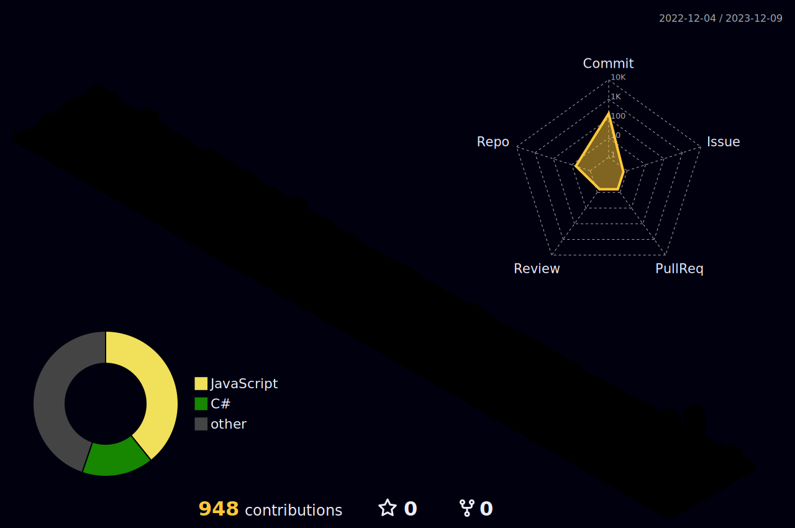

# Greetings!

:wave: I'm Arek.  
I'm a self-taught programmer and I'm currently learning C#.
<!---
:computer: I'm currenty learning C#. Looking forward to become a software developer one day!  
:swimmer: :bike: :runner: In my free time I try my best at swimming, cycling and running.  
--->

<!--- icons: 40x40 --->
<!---
Languages and tech stack: (tech stack or tools?)

--->

<!--- icons: 40x40 --->
You can find me here:  

<!---
 
--->
<!--- (https://git.io/streak-stats) --->
<!--- (https://github.com/anuraghazra/github-readme-stats) --->

<!---

--->
