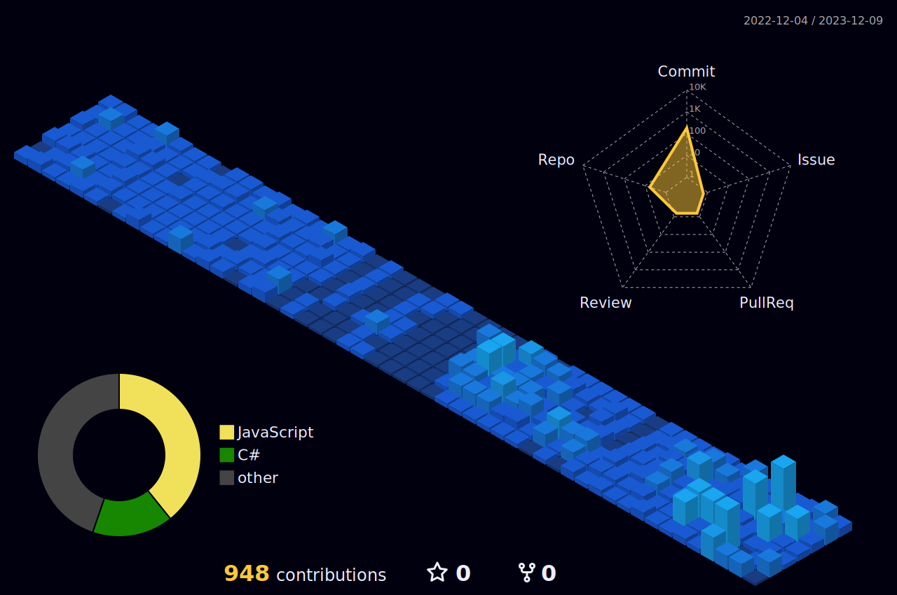

# 👋 Hi! I'm Arek. Welcome to my GitHub!

### 🌌 About me

💻 self-taught programmer\
🕵️‍♂️ recently started my first job as a C# developer\
🧠 constantly improving my coding skills in C#/.NET and learning new things

### 🔭 Connect with me

### 🎯 Languages & tools

### 📈 My GithHub stats
<!--
>)
-->

\
Chart made with [GitHubStats](https://github.com/arekjg/GitHubStats), includes private and public repos - last update: 09/02/2024

<!-- 
Chart made with [GitHub Profile 3D Contrib.](https://github.com/yoshi389111/github-profile-3d-contrib), shows last year's contributions -->